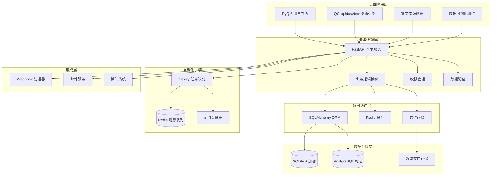
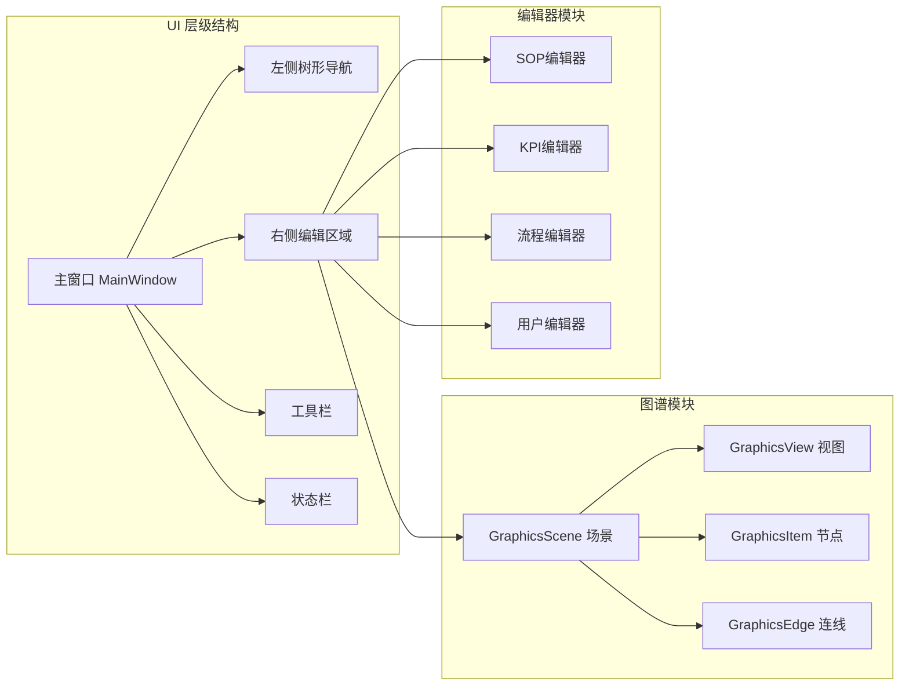
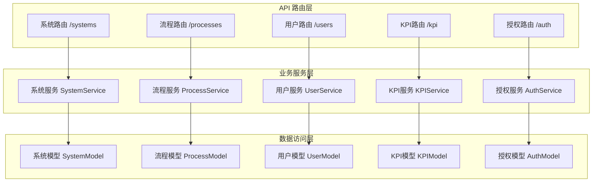
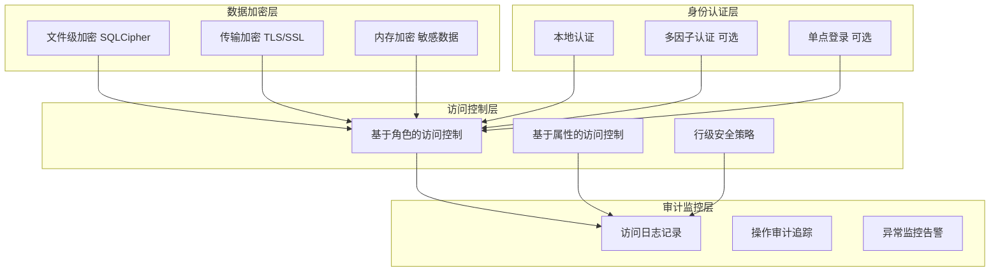
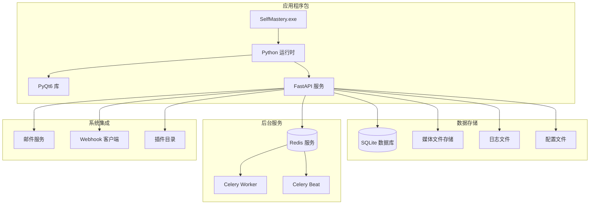

# SelfMastery 技术架构设计方案

## 项目概述

SelfMastery 是一款为中小企业创始人量身打造的**自动化商业系统**。通过系统化梳理业务流程、权责分配与授权、SOP 标准化以及数据驱动的 KPI 监控，帮助企业摆脱"创始人亲力亲为"与"日常救火"的困境。

### 核心特性
- **目标用户**: 5-200人规模企业的创始人及管理者
- **部署模式**: 纯本地架构，最大化数据安全性和响应速度
- **技术栈**: PyQt6 + FastAPI + SQLite + Celery + Redis

## 1. 系统整体架构设计



### 架构设计原则

1. **分层解耦**: 清晰的分层架构，便于维护和扩展
2. **本地优先**: 核心功能完全本地化，确保数据安全和响应速度
3. **模块化**: 高内聚低耦合的模块设计，支持独立开发和测试
4. **可扩展**: 预留插件接口和扩展点，支持第三方集成
5. **高性能**: 异步处理、缓存优化和数据库索引优化
6. **用户体验**: 响应式界面设计，支持拖拽操作和快捷键
7. **数据安全**: 多层加密保护，完善的权限控制和审计机制

## 2. 详细模块划分和职责

### 2.1 前端模块架构



#### 前端核心组件

| 组件名称 | 职责描述 | 技术实现 |
|---------|---------|---------|
| **MainWindow** | 主窗口容器，管理整体布局 | QMainWindow + QSplitter |
| **SystemTreeWidget** | 左侧系统树形导航 | QTreeWidget + 自定义模型 |
| **GraphicsCanvas** | 业务系统图谱绘制区域 | QGraphicsView + QGraphicsScene |
| **SOPEditor** | SOP富文本编辑器 | QTextEdit + Markdown渲染 |
| **KPIDashboard** | KPI仪表盘展示 | QChartView + 自定义图表 |
| **PropertyPanel** | 属性编辑面板 | QFormLayout + 动态控件 |
| **ToolbarManager** | 工具栏管理器 | QToolBar + QAction |
| **WizardDialog** | 首次启动向导 | QWizard + 自定义页面 |
| **TemplateSelector** | 行业模板选择器 | QListWidget + 预览面板 |
| **AIAssistant** | AI助手面板 | QTextEdit + 对话界面 |
| **NotificationCenter** | 通知中心 | QSystemTrayIcon + 弹窗 |

### 2.2 后端模块架构



#### 后端核心服务

| 服务名称 | 职责描述 | 主要功能 |
|---------|---------|---------|
| **SystemService** | 功能系统管理 | CRUD操作、层级关系、权限校验 |
| **ProcessService** | 业务流程管理 | 流程编排、连接关系、状态管理 |
| **UserService** | 用户管理 | 用户认证、角色管理、权限分配 |
| **KPIService** | KPI指标管理 | 数据收集、计算分析、预警通知 |
| **AuthService** | 授权管理 | 权限授予、撤销、审计追踪 |
| **TaskService** | 任务管理 | 任务创建、分配、状态跟踪 |
| **NotificationService** | 通知服务 | 邮件发送、消息推送、提醒管理 |
| **AIService** | AI助手服务 | LLM集成、智能分析、内容生成 |
| **WizardService** | 向导服务 | 初始化向导、模板应用、进度跟踪 |
| **TemplateService** | 模板服务 | 模板管理、行业库、自定义模板 |
| **IntegrationService** | 集成服务 | 第三方API、Webhook、数据同步 |

## 3. 数据库设计优化

### 3.1 核心数据模型

```sql
-- 用户表
CREATE TABLE users (
    id INTEGER PRIMARY KEY AUTOINCREMENT,
    name VARCHAR(100) NOT NULL,
    email VARCHAR(255) UNIQUE NOT NULL,
    role VARCHAR(50) NOT NULL,
    timezone VARCHAR(50) DEFAULT 'Asia/Shanghai',
    password_hash VARCHAR(255),
    is_active BOOLEAN DEFAULT TRUE,
    created_at TIMESTAMP DEFAULT CURRENT_TIMESTAMP,
    updated_at TIMESTAMP DEFAULT CURRENT_TIMESTAMP
);

-- 功能系统表
CREATE TABLE function_systems (
    id INTEGER PRIMARY KEY AUTOINCREMENT,
    name VARCHAR(200) NOT NULL,
    description TEXT,
    owner_id INTEGER NOT NULL,
    parent_id INTEGER,
    position_x REAL DEFAULT 0,
    position_y REAL DEFAULT 0,
    color VARCHAR(7) DEFAULT '#1E40AF',
    is_active BOOLEAN DEFAULT TRUE,
    created_at TIMESTAMP DEFAULT CURRENT_TIMESTAMP,
    updated_at TIMESTAMP DEFAULT CURRENT_TIMESTAMP,
    FOREIGN KEY (owner_id) REFERENCES users(id),
    FOREIGN KEY (parent_id) REFERENCES function_systems(id)
);

-- 业务流程表
CREATE TABLE processes (
    id INTEGER PRIMARY KEY AUTOINCREMENT,
    system_id INTEGER NOT NULL,
    name VARCHAR(200) NOT NULL,
    description TEXT,
    owner_id INTEGER NOT NULL,
    sop_id INTEGER,
    status VARCHAR(50) DEFAULT 'draft',
    priority INTEGER DEFAULT 3,
    estimated_duration INTEGER, -- 分钟
    position_x REAL DEFAULT 0,
    position_y REAL DEFAULT 0,
    is_active BOOLEAN DEFAULT TRUE,
    created_at TIMESTAMP DEFAULT CURRENT_TIMESTAMP,
    updated_at TIMESTAMP DEFAULT CURRENT_TIMESTAMP,
    FOREIGN KEY (system_id) REFERENCES function_systems(id),
    FOREIGN KEY (owner_id) REFERENCES users(id),
    FOREIGN KEY (sop_id) REFERENCES sops(id)
);

-- 流程连接关系表
CREATE TABLE process_connections (
    id INTEGER PRIMARY KEY AUTOINCREMENT,
    from_process_id INTEGER NOT NULL,
    to_process_id INTEGER NOT NULL,
    connection_type VARCHAR(50) DEFAULT 'sequence',
    condition_expression TEXT,
    created_at TIMESTAMP DEFAULT CURRENT_TIMESTAMP,
    FOREIGN KEY (from_process_id) REFERENCES processes(id),
    FOREIGN KEY (to_process_id) REFERENCES processes(id),
    UNIQUE(from_process_id, to_process_id)
);

-- SOP标准操作程序表
CREATE TABLE sops (
    id INTEGER PRIMARY KEY AUTOINCREMENT,
    title VARCHAR(200) NOT NULL,
    content TEXT NOT NULL, -- Markdown格式
    version VARCHAR(20) DEFAULT '1.0',
    author_id INTEGER NOT NULL,
    status VARCHAR(50) DEFAULT 'draft',
    media_refs TEXT, -- JSON格式存储媒体文件引用
    template_id INTEGER,
    created_at TIMESTAMP DEFAULT CURRENT_TIMESTAMP,
    updated_at TIMESTAMP DEFAULT CURRENT_TIMESTAMP,
    FOREIGN KEY (author_id) REFERENCES users(id),
    FOREIGN KEY (template_id) REFERENCES sop_templates(id)
);

-- KPI指标表
CREATE TABLE kpis (
    id INTEGER PRIMARY KEY AUTOINCREMENT,
    process_id INTEGER NOT NULL,
    name VARCHAR(200) NOT NULL,
    description TEXT,
    metric_type VARCHAR(50) NOT NULL, -- count, percentage, amount, duration
    target_value REAL,
    current_value REAL DEFAULT 0,
    unit VARCHAR(50),
    data_source VARCHAR(100), -- manual, api, webhook, file
    source_config TEXT, -- JSON格式配置
    update_frequency VARCHAR(50) DEFAULT 'daily',
    is_active BOOLEAN DEFAULT TRUE,
    created_at TIMESTAMP DEFAULT CURRENT_TIMESTAMP,
    updated_at TIMESTAMP DEFAULT CURRENT_TIMESTAMP,
    FOREIGN KEY (process_id) REFERENCES processes(id)
);

-- 授权记录表
CREATE TABLE authorizations (
    id INTEGER PRIMARY KEY AUTOINCREMENT,
    grantor_id INTEGER NOT NULL, -- 授权人
    grantee_id INTEGER NOT NULL, -- 被授权人
    resource_type VARCHAR(50) NOT NULL, -- system, process, kpi
    resource_id INTEGER NOT NULL,
    permission_level VARCHAR(50) NOT NULL, -- read, write, admin
    start_date DATE,
    end_date DATE,
    conditions TEXT, -- JSON格式存储授权条件
    status VARCHAR(50) DEFAULT 'active',
    created_at TIMESTAMP DEFAULT CURRENT_TIMESTAMP,
    updated_at TIMESTAMP DEFAULT CURRENT_TIMESTAMP,
    FOREIGN KEY (grantor_id) REFERENCES users(id),
    FOREIGN KEY (grantee_id) REFERENCES users(id)
);

-- 任务表
CREATE TABLE tasks (
    id INTEGER PRIMARY KEY AUTOINCREMENT,
    process_id INTEGER NOT NULL,
    title VARCHAR(200) NOT NULL,
    description TEXT,
    assignee_id INTEGER,
    status VARCHAR(50) DEFAULT 'pending',
    priority INTEGER DEFAULT 3,
    due_date TIMESTAMP,
    completed_at TIMESTAMP,
    created_at TIMESTAMP DEFAULT CURRENT_TIMESTAMP,
    updated_at TIMESTAMP DEFAULT CURRENT_TIMESTAMP,
    FOREIGN KEY (process_id) REFERENCES processes(id),
    FOREIGN KEY (assignee_id) REFERENCES users(id)
);

-- KPI历史数据表
CREATE TABLE kpi_history (
    id INTEGER PRIMARY KEY AUTOINCREMENT,
    kpi_id INTEGER NOT NULL,
    value REAL NOT NULL,
    recorded_at TIMESTAMP DEFAULT CURRENT_TIMESTAMP,
    source VARCHAR(100),
    notes TEXT,
    FOREIGN KEY (kpi_id) REFERENCES kpis(id)
);

-- SOP模板表
CREATE TABLE sop_templates (
    id INTEGER PRIMARY KEY AUTOINCREMENT,
    name VARCHAR(200) NOT NULL,
    category VARCHAR(100),
    content_template TEXT NOT NULL,
    variables TEXT, -- JSON格式存储模板变量
    is_public BOOLEAN DEFAULT FALSE,
    created_by INTEGER NOT NULL,
    created_at TIMESTAMP DEFAULT CURRENT_TIMESTAMP,
    FOREIGN KEY (created_by) REFERENCES users(id)
);

-- 行业模板表
CREATE TABLE industry_templates (
    id INTEGER PRIMARY KEY AUTOINCREMENT,
    name VARCHAR(200) NOT NULL,
    industry VARCHAR(100) NOT NULL,
    description TEXT,
    template_data TEXT NOT NULL, -- JSON格式存储模板结构
    systems_count INTEGER DEFAULT 0,
    processes_count INTEGER DEFAULT 0,
    is_featured BOOLEAN DEFAULT FALSE,
    download_count INTEGER DEFAULT 0,
    created_at TIMESTAMP DEFAULT CURRENT_TIMESTAMP,
    updated_at TIMESTAMP DEFAULT CURRENT_TIMESTAMP
);

-- 向导进度表
CREATE TABLE wizard_progress (
    id INTEGER PRIMARY KEY AUTOINCREMENT,
    user_id INTEGER NOT NULL,
    current_step VARCHAR(50) NOT NULL,
    completed_steps TEXT, -- JSON数组存储已完成步骤
    template_id INTEGER,
    configuration TEXT, -- JSON格式存储配置数据
    is_completed BOOLEAN DEFAULT FALSE,
    created_at TIMESTAMP DEFAULT CURRENT_TIMESTAMP,
    updated_at TIMESTAMP DEFAULT CURRENT_TIMESTAMP,
    FOREIGN KEY (user_id) REFERENCES users(id),
    FOREIGN KEY (template_id) REFERENCES industry_templates(id)
);

-- AI对话历史表
CREATE TABLE ai_conversations (
    id INTEGER PRIMARY KEY AUTOINCREMENT,
    user_id INTEGER NOT NULL,
    session_id VARCHAR(100) NOT NULL,
    message_type VARCHAR(20) NOT NULL, -- user, assistant, system
    content TEXT NOT NULL,
    context_data TEXT, -- JSON格式存储上下文
    created_at TIMESTAMP DEFAULT CURRENT_TIMESTAMP,
    FOREIGN KEY (user_id) REFERENCES users(id)
);

-- 系统配置表
CREATE TABLE system_config (
    id INTEGER PRIMARY KEY AUTOINCREMENT,
    config_key VARCHAR(100) UNIQUE NOT NULL,
    config_value TEXT,
    config_type VARCHAR(50) DEFAULT 'string',
    description TEXT,
    is_encrypted BOOLEAN DEFAULT FALSE,
    updated_at TIMESTAMP DEFAULT CURRENT_TIMESTAMP
);
```

### 3.2 索引优化策略

```sql
-- 性能优化索引
CREATE INDEX idx_users_email ON users(email);
CREATE INDEX idx_users_role ON users(role);
CREATE INDEX idx_systems_owner ON function_systems(owner_id);
CREATE INDEX idx_systems_parent ON function_systems(parent_id);
CREATE INDEX idx_processes_system ON processes(system_id);
CREATE INDEX idx_processes_owner ON processes(owner_id);
CREATE INDEX idx_processes_status ON processes(status);
CREATE INDEX idx_kpis_process ON kpis(process_id);
CREATE INDEX idx_kpis_active ON kpis(is_active);
CREATE INDEX idx_auth_grantee ON authorizations(grantee_id);
CREATE INDEX idx_auth_resource ON authorizations(resource_type, resource_id);
CREATE INDEX idx_tasks_assignee ON tasks(assignee_id);
CREATE INDEX idx_tasks_status ON tasks(status);
CREATE INDEX idx_tasks_due_date ON tasks(due_date);
CREATE INDEX idx_kpi_history_kpi_time ON kpi_history(kpi_id, recorded_at);

-- 复合索引
CREATE INDEX idx_processes_system_status ON processes(system_id, status);
CREATE INDEX idx_auth_active ON authorizations(grantee_id, status, end_date);
CREATE INDEX idx_tasks_assignee_status ON tasks(assignee_id, status);

-- 新增表索引
CREATE INDEX idx_industry_templates_industry ON industry_templates(industry);
CREATE INDEX idx_industry_templates_featured ON industry_templates(is_featured);
CREATE INDEX idx_wizard_progress_user ON wizard_progress(user_id);
CREATE INDEX idx_wizard_progress_step ON wizard_progress(current_step);
CREATE INDEX idx_ai_conversations_user_session ON ai_conversations(user_id, session_id);
CREATE INDEX idx_ai_conversations_created ON ai_conversations(created_at);
```

### 3.3 数据库配置优化

```sql
-- SQLite 性能优化配置
PRAGMA journal_mode = WAL;           -- 启用WAL模式提高并发性能
PRAGMA synchronous = NORMAL;         -- 平衡性能和安全性
PRAGMA cache_size = 10000;           -- 增加缓存大小
PRAGMA temp_store = MEMORY;          -- 临时表存储在内存中
PRAGMA mmap_size = 268435456;        -- 启用内存映射(256MB)
PRAGMA optimize;                     -- 自动优化查询计划
```

## 4. API接口设计

### 4.1 RESTful API 规范

```python
# 系统管理 API
GET    /api/v1/systems                    # 获取系统列表
POST   /api/v1/systems                    # 创建新系统
GET    /api/v1/systems/{id}               # 获取系统详情
PUT    /api/v1/systems/{id}               # 更新系统
DELETE /api/v1/systems/{id}               # 删除系统
GET    /api/v1/systems/{id}/processes     # 获取系统下的流程
POST   /api/v1/systems/{id}/clone         # 克隆系统

# 流程管理 API
GET    /api/v1/processes                  # 获取流程列表
POST   /api/v1/processes                  # 创建新流程
GET    /api/v1/processes/{id}             # 获取流程详情
PUT    /api/v1/processes/{id}             # 更新流程
DELETE /api/v1/processes/{id}             # 删除流程
POST   /api/v1/processes/{id}/connections # 创建流程连接
GET    /api/v1/processes/{id}/kpis        # 获取流程KPI
POST   /api/v1/processes/{id}/validate    # 验证流程完整性

# SOP管理 API
GET    /api/v1/sops                       # 获取SOP列表
POST   /api/v1/sops                       # 创建新SOP
GET    /api/v1/sops/{id}                  # 获取SOP详情
PUT    /api/v1/sops/{id}                  # 更新SOP
DELETE /api/v1/sops/{id}                  # 删除SOP
POST   /api/v1/sops/ai-generate           # AI生成SOP草稿
GET    /api/v1/sops/{id}/versions         # 获取SOP版本历史
POST   /api/v1/sops/{id}/publish          # 发布SOP版本
POST   /api/v1/sops/from-template         # 从模板创建SOP
GET    /api/v1/sops/{id}/export           # 导出SOP文档

# KPI管理 API
GET    /api/v1/kpis                       # 获取KPI列表
POST   /api/v1/kpis                       # 创建新KPI
GET    /api/v1/kpis/{id}                  # 获取KPI详情
PUT    /api/v1/kpis/{id}                  # 更新KPI
DELETE /api/v1/kpis/{id}                  # 删除KPI
POST   /api/v1/kpis/{id}/data             # 推送KPI数据
GET    /api/v1/kpis/{id}/history          # 获取KPI历史数据
GET    /api/v1/kpis/{id}/analysis         # 获取KPI分析报告

# 授权管理 API
GET    /api/v1/authorizations             # 获取授权列表
POST   /api/v1/authorizations             # 创建新授权
GET    /api/v1/authorizations/{id}        # 获取授权详情
PUT    /api/v1/authorizations/{id}        # 更新授权
DELETE /api/v1/authorizations/{id}        # 删除授权
POST   /api/v1/authorizations/batch       # 批量授权
GET    /api/v1/authorizations/audit       # 获取授权审计日志

# 任务管理 API
GET    /api/v1/tasks                      # 获取任务列表
POST   /api/v1/tasks                      # 创建新任务
GET    /api/v1/tasks/{id}                 # 获取任务详情
PUT    /api/v1/tasks/{id}                 # 更新任务
DELETE /api/v1/tasks/{id}                 # 删除任务
POST   /api/v1/tasks/{id}/complete        # 完成任务
GET    /api/v1/tasks/my                   # 获取我的任务
POST   /api/v1/tasks/bulk-update          # 批量更新任务

# 用户管理 API
GET    /api/v1/users                      # 获取用户列表
POST   /api/v1/users                      # 创建新用户
GET    /api/v1/users/{id}                 # 获取用户详情
PUT    /api/v1/users/{id}                 # 更新用户
DELETE /api/v1/users/{id}                 # 删除用户
GET    /api/v1/users/me                   # 获取当前用户信息
PUT    /api/v1/users/me/password          # 修改密码

# 模板管理 API
GET    /api/v1/templates/sop              # 获取SOP模板列表
POST   /api/v1/templates/sop              # 创建SOP模板
GET    /api/v1/templates/system           # 获取系统模板列表
POST   /api/v1/templates/system           # 创建系统模板

# Webhook API
POST   /api/v1/webhooks/kpi               # KPI数据推送
POST   /api/v1/webhooks/task              # 任务状态更新
POST   /api/v1/webhooks/notification      # 通知推送

# 文件管理 API
POST   /api/v1/files/upload               # 文件上传
GET    /api/v1/files/{id}                 # 文件下载
# AI助手 API
POST   /api/v1/ai/analyze-bottleneck       # AI分析业务瓶颈
POST   /api/v1/ai/suggest-optimization     # AI建议优化方案
POST   /api/v1/ai/generate-sop             # AI生成SOP内容
POST   /api/v1/ai/extract-process          # AI从文档提取流程
GET    /api/v1/ai/templates                # 获取AI模板库
POST   /api/v1/ai/chat                     # AI对话助手
# 向导系统 API
GET    /api/v1/wizard/industry-templates   # 获取行业模板
POST   /api/v1/wizard/initialize           # 初始化业务系统
GET    /api/v1/wizard/progress             # 获取向导进度
POST   /api/v1/wizard/step/{step_id}       # 完成向导步骤
GET    /api/v1/wizard/validation           # 验证配置完整性
DELETE /api/v1/files/{id}                 # 删除文件
```

### 4.2 API响应格式标准

```python
# 成功响应格式
{
    "success": true,
    "data": {
        # 实际数据
    },
    "message": "操作成功",
    "timestamp": "2024-01-01T00:00:00Z"
}

# 错误响应格式
{
    "success": false,
    "error": {
        "code": "VALIDATION_ERROR",
        "message": "数据验证失败",
        "details": {
            "field": "name",
            "reason": "名称不能为空"
        }
    },
    "timestamp": "2024-01-01T00:00:00Z"
}

# 分页响应格式
{
    "success": true,
    "data": {
        "items": [...],
        "pagination": {
            "page": 1,
            "size": 20,
            "total": 100,
            "pages": 5
        }
    }
}
```

### 4.3 API认证和授权

```python
# JWT Token 格式
{
    "user_id": 123,
    "username": "admin",
    "role": "admin",
    "permissions": ["system:read", "system:write"],
    "exp": 1640995200,
    "iat": 1640908800
}

# 权限检查装饰器
@require_permission("system:write")
async def update_system(system_id: int, system_data: SystemUpdate):
    pass

# 资源级权限检查
@require_resource_permission("system", "write")
async def update_system(system_id: int, system_data: SystemUpdate):
    pass
```

## 5. 安全架构设计

### 5.1 数据安全策略



### 5.2 权限控制模型

```python
# 权限级别定义
PERMISSION_LEVELS = {
    'read': 1,      # 只读权限
    'write': 2,     # 读写权限
    'admin': 3,     # 管理权限
    'owner': 4      # 所有者权限
}

# 资源类型定义
RESOURCE_TYPES = {
    'system': 'function_systems',
    'process': 'processes',
    'sop': 'sops',
    'kpi': 'kpis',
    'task': 'tasks',
    'user': 'users'
}

# 角色权限矩阵
ROLE_PERMISSIONS = {
    'admin': {
        'system': 'admin',
        'process': 'admin',
        'sop': 'admin',
        'kpi': 'admin',
        'task': 'admin',
        'user': 'admin'
    },
    'manager': {
        'system': 'write',
        'process': 'admin',
        'sop': 'write',
        'kpi': 'write',
        'task': 'write',
        'user': 'read'
    },
    'employee': {
        'system': 'read',
        'process': 'read',
        'sop': 'read',
        'kpi': 'read',
        'task': 'write',
        'user': 'read'
    }
}

# 权限检查实现
class PermissionChecker:
    def __init__(self, user: User):
        self.user = user
    
    def has_permission(self, resource_type: str, resource_id: int, 
                      required_level: str) -> bool:
        # 检查角色权限
        role_permission = ROLE_PERMISSIONS.get(self.user.role, {})
        role_level = role_permission.get(resource_type, 'none')
        
        if self._compare_permission_level(role_level, required_level):
            return True
        
        # 检查直接授权
        authorization = self._get_authorization(resource_type, resource_id)
        if authorization and self._is_authorization_valid(authorization):
            return self._compare_permission_level(
                authorization.permission_level, required_level
            )
        
        return False
    
    def _compare_permission_level(self, current: str, required: str) -> bool:
        current_level = PERMISSION_LEVELS.get(current, 0)
        required_level = PERMISSION_LEVELS.get(required, 0)
        return current_level >= required_level
```

### 5.3 数据加密策略

```python
# 数据库加密配置
class DatabaseEncryption:
    def __init__(self, encryption_key: str):
        self.encryption_key = encryption_key
    
    def setup_sqlite_encryption(self, db_path: str):
        """配置SQLite数据库加密"""
        connection_string = f"sqlite+pysqlcipher://:{self.encryption_key}@/{db_path}"
        return connection_string
    
    def encrypt_sensitive_field(self, data: str) -> str:
        """加密敏感字段"""
        from cryptography.fernet import Fernet
        f = Fernet(self.encryption_key.encode())
        return f.encrypt(data.encode()).decode()
    
    def decrypt_sensitive_field(self, encrypted_data: str) -> str:
        """解密敏感字段"""
        from cryptography.fernet import Fernet
        f = Fernet(self.encryption_key.encode())
        return f.decrypt(encrypted_data.encode()).decode()

# 敏感数据处理
class SensitiveDataHandler:
    SENSITIVE_FIELDS = ['password_hash', 'api_keys', 'webhook_secrets']
    
    def mask_sensitive_data(self, data: dict) -> dict:
        """遮蔽敏感数据用于日志记录"""
        masked_data = data.copy()
        for field in self.SENSITIVE_FIELDS:
            if field in masked_data:
                masked_data[field] = "***MASKED***"
        return masked_data
```

### 5.4 审计日志系统

```python
# 审计日志模型
class AuditLog:
    def __init__(self):
        self.user_id = None
        self.action = None
        self.resource_type = None
        self.resource_id = None
        self.old_values = None
        self.new_values = None
        self.ip_address = None
        self.user_agent = None
        self.timestamp = None
        self.success = None
        self.error_message = None

# 审计日志装饰器
def audit_log(action: str, resource_type: str):
    def decorator(func):
        async def wrapper(*args, **kwargs):
            audit = AuditLog()
            audit.action = action
            audit.resource_type = resource_type
            audit.user_id = get_current_user_id()
            audit.timestamp = datetime.utcnow()
            
            try:
                result = await func(*args, **kwargs)
                audit.success = True
                await save_audit_log(audit)
                return result
            except Exception as e:
                audit.success = False
                audit.error_message = str(e)
                await save_audit_log(audit)
                raise
        return wrapper
    return decorator
```

## 6. 部署架构方案

### 6.1 本地部署架构



### 6.2 部署配置管理

```python
# 部署配置类
class DeploymentConfig:
    def __init__(self, environment: str = "production"):
        self.environment = environment
        self.app_name = "SelfMastery"
        self.version = "1.0.0"
        
    def get_database_config(self) -> dict:
        """获取数据库配置"""
        if self.environment == "production":
            return {
                "url": "sqlite:///./data/selfmastery.db",
                "encryption_key": os.getenv("DB_ENCRYPTION_KEY"),
                "pool_size": 20,
                "max_overflow": 30,
                "pool_timeout": 30,
                "pool_recycle": 3600
            }
        else:
            return {
                "url": "sqlite:///./data/selfmastery_dev.db",
                "encryption_key": "dev_key_only",
                "echo": True
            }
    
    def get_redis_config(self) -> dict:
        """获取Redis配置"""
        return {
            "host": "localhost",
            "port": 6379,
            "db": 0,
            "password": os.getenv("REDIS_PASSWORD"),
            "socket_timeout": 5,
            "socket_connect_timeout": 5,
            "retry_on_timeout": True,
            "health_check_interval": 30
        }
    
    def get_celery_config(self) -> dict:
        """获取Celery配置"""
        return {
            "broker_url": "redis://localhost:6379/0",
            "result_backend": "redis://localhost:6379/0",
            "task_serializer": "json",
            "accept_content": ["json"],
            "result_serializer": "json",
            "timezone": "Asia/Shanghai",
            "enable_utc": True,
            "task_track_started": True,
            "task_time_limit": 30 * 60,  # 30分钟
            "task_soft_time_limit": 25 * 60,  # 25分钟
            "worker_prefetch_multiplier": 1,
            "worker_max_tasks_per_child": 1000
        }
```

### 6.3 安装包构建

```python
# PyInstaller 构建配置
# build.spec
import sys
import os
from PyInstaller.utils.hooks import collect_data_files, collect_submodules

block_cipher = None

# 收集数据文件
datas = []
datas += collect_data_files('fastapi')
datas += collect_data_files('sqlalchemy')
datas += [('templates', 'templates')]
datas += [('static', 'static')]
datas += [('config', 'config')]

# 收集隐藏导入
hiddenimports = []
hiddenimports += collect_submodules('sqlalchemy')
hiddenimports += collect_submodules('celery')
hiddenimports += collect_submodules('redis')
hiddenimports += ['uvicorn', 'uvicorn.lifespan', 'uvicorn.lifespan.on']

a = Analysis(
    ['main.py'],
    pathex=[],
    binaries=[],
    datas=datas,
    hiddenimports=hiddenimports,
    hookspath=[],
    hooksconfig={},
    runtime_hooks=[],
    excludes=[],
    win_no_prefer_redirects=False,
    win_private_assemblies=False,
    cipher=block_cipher,
    noarchive=False,
)

pyz = PYZ(a.pure, a.zipped_data, cipher=block_cipher)

exe = EXE(
    pyz,
    a.scripts,
    a.binaries,
    a.zipfiles,
    a.datas,
    [],
    name='SelfMastery',
    debug=False,
    bootloader_ignore_signals=False,
    strip=False,
    upx=True,
    upx_exclude=[],
    runtime_tmpdir=None,
    console=False,
    disable_windowed_traceback=False,
    argv_emulation=False,
    target_arch=None,
    codesign_identity=None,
    entitlements_file=None,
    icon='assets/icon.ico'
)
```

### 6.4 系统要求和兼容性

| 组件 | 最低要求 | 推荐配置 |
|------|---------|---------|
| **操作系统** | Windows 10, macOS 10.15, Ubuntu 18.04 | Windows 11, macOS 12+, Ubuntu 20.04+ |
| **内存** | 4GB RAM | 8GB+ RAM |
| **存储** | 2GB 可用空间 | 10GB+ 可用空间 |
| **处理器** | 双核 2.0GHz | 四核 2.5GHz+ |
| **网络** | 可选（离线模式） | 宽带连接（云同步） |
| **Python** | 3.9+ | 3.11+ |

## 7. 性能优化策略

### 7.1 前端性能优化

```python
# 图形渲染优化
class OptimizedGraphicsView(QGraphicsView):
    def __init__(self, parent=None):
        super().__init__(parent)
        # 启用OpenGL渲染加速
        self.setViewport(QOpenGLWidget())
        # 优化渲染设置
        self.setRenderHints(
            QPainter.Antialiasing |
            QPainter.SmoothPixmapTransform |
            QPainter.TextAntialiasing
        )
        # 启用缓存模式
        self.setCacheMode(QGraphicsView.CacheBackground)
        # 优化拖拽模式
        self.setDragMode(QGraphicsView.RubberBandDrag)
        # 设置视口更新模式
        self.setViewportUpdateMode(QGraphicsView.SmartViewportUpdate)
    
    def wheelEvent(self, event):
        """优化缩放性能"""
        # 限制缩放范围
        scale_factor = 1.15
        if event.angleDelta().y() > 0:
            if self.transform().m11() < 3.0:  # 最大放大3倍
                self.scale(scale_factor, scale_factor)
        else:
            if self.transform().m11() > 0.3:  # 最小缩小到30%
                self.scale(1/scale_factor, 1/scale_factor)

# 数据加载优化
class LazyLoadingModel(QAbstractItemModel):
    def __init__(self, parent=None):
        super().__init__(parent)
        self._cache = {}
        self._page_size = 50
    
    def data(self, index, role=Qt.DisplayRole):
        """延迟加载数据"""
        if not index.isValid():
            return None
        
        row = index.row()
        page = row // self._page_size
        
        if page not in self._cache:
            self._load_page(page)
        
        return self._cache[page][row % self._page_size]
    
    def _load_page(self, page):
        """加载指定页面的数据"""
        offset = page * self._page_size
        # 从数据库加载数据
        data = self._fetch_data(offset, self._page_size)
        self._cache[page] = data
```

### 7.2 后端性能优化

```python
# 数据库查询优化
class OptimizedQueryService:
    def __init__(self, db_session):
        self.db = db_session
    
    async def get_systems_with_processes(self, user_id: int):
        """优化的系统和流程查询"""
        # 使用预加载避免N+1查询
        query = (
            select(FunctionSystem)
            .options(
                selectinload(FunctionSystem.processes)
                .selectinload(Process.kpis),
                selectinload(FunctionSystem.owner)
            )
            .where(FunctionSystem.owner_id == user_id)
            .order_by(FunctionSystem.created_at.desc())
        )
        
        result = await self.db.execute(query)
        return result.scalars().all()
    
    async def get_kpi_dashboard_data(self, system_ids: List[int]):
        """优化的KPI仪表盘数据查询"""
        # 使用子查询优化
        subquery = (
            select(
                KPIHistory.kpi_id,
                func.max(KPIHistory.recorded_at).label('latest_time')
            )
            .group_by(KPIHistory.kpi_id)
            .subquery()
        )
        
        query = (
            select(KPI, KPIHistory.value, KPIHistory.recorded_at)
            .join(Process, KPI.process_id == Process.id)
            .join(subquery, KPI.id == subquery.c.kpi_id)
            .join(
                KPIHistory,
                and_(
                    KPI.id == KPIHistory.kpi_id,
                    KPIHistory.recorded_at == subquery.c.latest_time
                )
            )
            .where(Process.system_id.in_(system_ids))
        )
        
        result = await self.db.execute(query)
        return result.all()

# 缓存策略
from functools import wraps
import redis
import json

redis_client = redis.Redis(host='localhost', port=6379, db=0)

def cache_result(expire_time: int = 300):
    """结果缓存装饰器"""
    def decorator(func):
        @wraps(func)
        async def wrapper(*args, **kwargs):
            # 生成缓存键
            cache_key = f"{func.__name__}:{hash(str(args) + str(kwargs))}"
            
            # 尝试从缓存获取
            cached_result = redis_client.get(cache_key)
            if cached_result:
                return json.loads(cached_result)
            
            # 执行函数并缓存结果
            result = await func(*args, **kwargs)
            redis_client.setex(
                cache_key,
                expire_time,
                json.dumps(result, default=str)
            )
            
            return result
        return wrapper
    return decorator
```

### 7.3 内存管理优化

```python
# 内存池管理
class MemoryPool:
    def __init__(self, max_size: int = 1000):
        self.max_size = max_size
        self.pool = {}
        self.usage_count = {}
    
    def get_object(self, obj_type: type, *args, **kwargs):
        """从内存池获取对象"""
        key = (obj_type, args, tuple(kwargs.items()))
        
        if key in self.pool:
            self.usage_count[key] += 1
            return self.pool[key]
        
        # 检查池大小
        if len(self.pool) >= self.max_size:
            self._cleanup_least_used()
## 11. 核心功能技术实现

### 11.1 拖拽式业务系统图谱

```python
# 自定义图形节点类
class BusinessSystemNode(QGraphicsItem):
    def __init__(self, system_data: dict, parent=None):
        super().__init__(parent)
        self.system_data = system_data
        self.setFlag(QGraphicsItem.ItemIsMovable, True)
        self.setFlag(QGraphicsItem.ItemIsSelectable, True)
        self.setFlag(QGraphicsItem.ItemSendsGeometryChanges, True)
        self.setAcceptHoverEvents(True)
        
        # 节点样式配置
        self.width = 120
        self.height = 80
        self.border_radius = 8
        self.border_width = 2
        
        # 状态颜色
        self.colors = {
            'normal': QColor('#1E40AF'),
            'selected': QColor('#F59E0B'),
            'hover': QColor('#3B82F6'),
            'error': QColor('#EF4444'),
            'success': QColor('#10B981')
        }
        
    def boundingRect(self) -> QRectF:
        """定义节点边界"""
        return QRectF(0, 0, self.width, self.height)
    
    def paint(self, painter: QPainter, option, widget=None):
        """绘制节点"""
        # 设置抗锯齿
        painter.setRenderHint(QPainter.Antialiasing)
        
        # 确定节点状态和颜色
        color = self.colors['normal']
        if self.isSelected():
            color = self.colors['selected']
        elif option.state & QStyle.State_MouseOver:
            color = self.colors['hover']
        
        # 绘制节点背景
        rect = self.boundingRect()
        painter.setBrush(QBrush(color))
        painter.setPen(QPen(color.darker(120), self.border_width))
        painter.drawRoundedRect(rect, self.border_radius, self.border_radius)
        
        # 绘制文本
        painter.setPen(QPen(QColor('white')))
        font = QFont('Arial', 10, QFont.Bold)
        painter.setFont(font)
        
        text_rect = rect.adjusted(5, 5, -5, -5)
        painter.drawText(text_rect, Qt.AlignCenter | Qt.TextWordWrap, 
                        self.system_data.get('name', '未命名系统'))
        
        # 绘制负责人状态指示器
        if self.system_data.get('owner_id'):
            indicator_rect = QRectF(rect.width() - 15, 5, 10, 10)
            painter.setBrush(QBrush(self.colors['success']))
            painter.setPen(QPen(self.colors['success']))
            painter.drawEllipse(indicator_rect)
    
    def itemChange(self, change, value):
        """处理节点变化事件"""
        if change == QGraphicsItem.ItemPositionChange:
            # 更新数据库中的位置
            self.update_position_in_db(value)
            
            # 更新连接线
            self.update_connections()
            
        return super().itemChange(change, value)
    
    def mousePressEvent(self, event):
        """鼠标按下事件"""
        if event.button() == Qt.RightButton:
            self.show_context_menu(event.screenPos())
        else:
            super().mousePressEvent(event)
    
    def show_context_menu(self, position):
        """显示右键菜单"""
        menu = QMenu()
        
        edit_action = menu.addAction("编辑系统")
        edit_action.triggered.connect(self.edit_system)
        
        delete_action = menu.addAction("删除系统")
        delete_action.triggered.connect(self.delete_system)
        
        menu.addSeparator()
        
        assign_action = menu.addAction("分配负责人")
        assign_action.triggered.connect(self.assign_owner)
        
        menu.exec_(position)

# 连接线类
class ProcessConnection(QGraphicsItem):
    def __init__(self, from_node: BusinessSystemNode, to_node: BusinessSystemNode):
        super().__init__()
        self.from_node = from_node
        self.to_node = to_node
        self.setZValue(-1)  # 置于节点下方
        
        # 连接线样式
        self.pen_width = 2
        self.arrow_size = 10
        
    def boundingRect(self) -> QRectF:
        """计算连接线边界"""
        from_pos = self.from_node.pos() + self.from_node.boundingRect().center()
        to_pos = self.to_node.pos() + self.to_node.boundingRect().center()
        
        return QRectF(from_pos, to_pos).normalized().adjusted(-10, -10, 10, 10)
    
    def paint(self, painter: QPainter, option, widget=None):
        """绘制连接线和箭头"""
        painter.setRenderHint(QPainter.Antialiasing)
        
        # 计算起点和终点
        from_center = self.from_node.pos() + self.from_node.boundingRect().center()
        to_center = self.to_node.pos() + self.to_node.boundingRect().center()
        
        # 计算节点边缘的连接点
        from_point = self.get_edge_point(self.from_node, to_center)
        to_point = self.get_edge_point(self.to_node, from_center)
        
        # 绘制连接线
        painter.setPen(QPen(QColor('#6B7280'), self.pen_width))
        painter.drawLine(from_point, to_point)
        
        # 绘制箭头
        self.draw_arrow(painter, from_point, to_point)
    
    def get_edge_point(self, node: BusinessSystemNode, target_point: QPointF) -> QPointF:
        """计算节点边缘的连接点"""
        node_center = node.pos() + node.boundingRect().center()
        node_rect = QRectF(node.pos(), node.boundingRect().size())
        
        # 计算方向向量
        direction = target_point - node_center
        
        # 计算与节点边界的交点
        if abs(direction.x()) > abs(direction.y()):
            # 水平方向
            if direction.x() > 0:
                return QPointF(node_rect.right(), node_center.y())
            else:
                return QPointF(node_rect.left(), node_center.y())
        else:
            # 垂直方向
            if direction.y() > 0:
                return QPointF(node_center.x(), node_rect.bottom())
            else:
                return QPointF(node_center.x(), node_rect.top())
    
    def draw_arrow(self, painter: QPainter, from_point: QPointF, to_point: QPointF):
        """绘制箭头"""
        # 计算箭头方向
        direction = to_point - from_point
        length = (direction.x() ** 2 + direction.y() ** 2) ** 0.5
        
        if length == 0:
            return
        
        unit_vector = QPointF(direction.x() / length, direction.y() / length)
        
        # 箭头顶点
        arrow_tip = to_point
        
        # 箭头两翼
        arrow_wing1 = arrow_tip - QPointF(
            unit_vector.x() * self.arrow_size - unit_vector.y() * self.arrow_size * 0.5,
            unit_vector.y() * self.arrow_size + unit_vector.x() * self.arrow_size * 0.5
        )
        
        arrow_wing2 = arrow_tip - QPointF(
            unit_vector.x() * self.arrow_size + unit_vector.y() * self.arrow_size * 0.5,
            unit_vector.y() * self.arrow_size - unit_vector.x() * self.arrow_size * 0.5
        )
        
        # 绘制箭头
        arrow_polygon = QPolygonF([arrow_tip, arrow_wing1, arrow_wing2])
        painter.setBrush(QBrush(QColor('#6B7280')))
        painter.drawPolygon(arrow_polygon)

# 图谱画布类
class BusinessSystemCanvas(QGraphicsView):
    def __init__(self, parent=None):
        super().__init__(parent)
        
        # 创建场景
        self.scene = QGraphicsScene(self)
        self.setScene(self.scene)
        
        # 设置视图属性
        self.setDragMode(QGraphicsView.RubberBandDrag)
        self.setRenderHint(QPainter.Antialiasing)
        self.setViewportUpdateMode(QGraphicsView.FullViewportUpdate)
        
        # 启用拖拽
        self.setAcceptDrops(True)
        
        # 节点和连接管理
        self.nodes = {}
        self.connections = []
        
        # 自动布局算法
        self.layout_algorithm = ForceDirectedLayout()
    
    def add_system_node(self, system_data: dict) -> BusinessSystemNode:
        """添加系统节点"""
        node = BusinessSystemNode(system_data)
        self.scene.addItem(node)
        self.nodes[system_data['id']] = node
        
        # 如果没有指定位置，使用自动布局
        if 'position_x' not in system_data or 'position_y' not in system_data:
            self.apply_auto_layout()
        else:
            node.setPos(system_data['position_x'], system_data['position_y'])
        
        return node
    
    def add_connection(self, from_system_id: int, to_system_id: int):
        """添加系统连接"""
        if from_system_id in self.nodes and to_system_id in self.nodes:
            from_node = self.nodes[from_system_id]
            to_node = self.nodes[to_system_id]
            
            connection = ProcessConnection(from_node, to_node)
            self.scene.addItem(connection)
            self.connections.append(connection)
    
    def apply_auto_layout(self):
        """应用自动布局算法"""
        if len(self.nodes) < 2:
            return
        
        # 使用力导向布局算法
        positions = self.layout_algorithm.calculate_layout(
            list(self.nodes.values()),
            self.connections
        )
        
        # 应用新位置
        for node, position in positions.items():
            node.setPos(position)
    
    def wheelEvent(self, event):
        """鼠标滚轮缩放"""
        scale_factor = 1.15
        
        if event.angleDelta().y() > 0:
            # 放大
            if self.transform().m11() < 3.0:
                self.scale(scale_factor, scale_factor)
        else:
            # 缩小
            if self.transform().m11() > 0.3:
                self.scale(1/scale_factor, 1/scale_factor)
    
    def dragEnterEvent(self, event):
        """拖拽进入事件"""
        if event.mimeData().hasFormat("application/x-system-template"):
            event.acceptProposedAction()
    
    def dropEvent(self, event):
        """拖拽放下事件"""
        if event.mimeData().hasFormat("application/x-system-template"):
            # 从模板创建新系统
            template_data = event.mimeData().data("application/x-system-template")
            position = self.mapToScene(event.pos())
            
            self.create_system_from_template(template_data, position)
            event.acceptProposedAction()

# 力导向布局算法
class ForceDirectedLayout:
    def __init__(self):
        self.iterations = 100
        self.spring_length = 150
        self.spring_strength = 0.1
        self.repulsion_strength = 1000
        self.damping = 0.9
    
    def calculate_layout(self, nodes: List[BusinessSystemNode], 
                        connections: List[ProcessConnection]) -> Dict[BusinessSystemNode, QPointF]:
        """计算力导向布局"""
        positions = {}
        velocities = {}
        
        # 初始化位置和速度
        for i, node in enumerate(nodes):
            angle = 2 * 3.14159 * i / len(nodes)
            radius = 100
            positions[node] = QPointF(
                radius * math.cos(angle),
                radius * math.sin(angle)
            )
            velocities[node] = QPointF(0, 0)
        
        # 迭代计算
        for iteration in range(self.iterations):
            forces = {node: QPointF(0, 0) for node in nodes}
            
            # 计算排斥力
            for i, node1 in enumerate(nodes):
                for j, node2 in enumerate(nodes):
                    if i != j:
                        force = self.calculate_repulsion_force(
                            positions[node1], positions[node2]
                        )
                        forces[node1] += force
            
            # 计算弹簧力
            for connection in connections:
                force = self.calculate_spring_force(
                    positions[connection.from_node],
                    positions[connection.to_node]
                )
                forces[connection.from_node] += force
                forces[connection.to_node] -= force
            
            # 更新位置和速度
            for node in nodes:
                velocities[node] = (velocities[node] + forces[node]) * self.damping
                positions[node] += velocities[node]
        
        return positions
    
    def calculate_repulsion_force(self, pos1: QPointF, pos2: QPointF) -> QPointF:
        """计算排斥力"""
        diff = pos1 - pos2
        distance = (diff.x() ** 2 + diff.y() ** 2) ** 0.5
        
        if distance < 1:
            distance = 1
        
        force_magnitude = self.repulsion_strength / (distance ** 2)
        return QPointF(
            diff.x() / distance * force_magnitude,
            diff.y() / distance * force_magnitude
        )
    
    def calculate_spring_force(self, pos1: QPointF, pos2: QPointF) -> QPointF:
        """计算弹簧力"""
        diff = pos2 - pos1
        distance = (diff.x() ** 2 + diff.y() ** 2) ** 0.5
        
        if distance == 0:
            return QPointF(0, 0)
        
        force_magnitude = self.spring_strength * (distance - self.spring_length)
        return QPointF(
            diff.x() / distance * force_magnitude,
            diff.y() / distance * force_magnitude
        )
```

### 11.2 首次启动向导系统

```python
# 向导主窗口
class BusinessSetupWizard(QWizard):
    def __init__(self, parent=None):
        super().__init__(parent)
        
        self.setWindowTitle("SelfMastery 业务系统设置向导")
        self.setWizardStyle(QWizard.ModernStyle)
        self.setOption(QWizard.HaveHelpButton, False)
        self.setOption(QWizard.HaveFinishButtonOnEarlyPages, False)
        
        # 添加向导页面
        self.addPage(WelcomePage())
        self.addPage(IndustrySelectionPage())
        self.addPage(TemplateCustomizationPage())
        self.addPage(TeamSetupPage())
        self.addPage(CompletionPage())
        
        # 设置样式
        self.setStyleSheet("""
            QWizard {
                background-color: #F8FAFC;
            }
            QWizard::title {
                font-size: 18px;
                font-weight: bold;
                color: #1E40AF;
            }
        """)

# 欢迎页面
class WelcomePage(QWizardPage):
    def __init__(self):
        super().__init__()
        
        self.setTitle("欢迎使用 SelfMastery")
        self.setSubTitle("让我们帮助您构建自动化的商业系统")
        
        layout = QVBoxLayout()
        
        # 欢迎文本
        welcome_text = QLabel("""
        <h2>欢迎来到 SelfMastery！</h2>
        <p>SelfMastery 是一款专为中小企业创始人设计的自动化商业系统。</p>
        <p>通过这个向导，我们将帮助您：</p>
        <ul>
            <li>选择适合您行业的业务模板</li>
            <li>构建可视化的业务系统图谱</li>
            <li>设置权责分配和授权机制</li>
            <li>建立标准化操作流程</li>
            <li>配置关键绩效指标监控</li>
        </ul>
        <p>整个过程大约需要 10-15 分钟。</p>
        """)
        welcome_text.setWordWrap(True)
        layout.addWidget(welcome_text)
        
        # 功能特性展示
        features_widget = self.create_features_widget()
        layout.addWidget(features_widget)
        
        self.setLayout(layout)
    
    def create_features_widget(self) -> QWidget:
        """创建功能特性展示组件"""
        widget = QWidget()
        layout = QHBoxLayout()
        
        features = [
            ("🎯", "业务系统图谱", "可视化业务流程关系"),
            ("👥", "权责分配", "明确每个环节的负责人"),
            ("📋", "SOP标准化", "建立标准操作程序"),
            ("📊", "KPI监控", "数据驱动的绩效管理")
        ]
        
        for icon, title, description in features:
            feature_card = self.create_feature_card(icon, title, description)
            layout.addWidget(feature_card)
        
        widget.setLayout(layout)
        return widget
    
    def create_feature_card(self, icon: str, title: str, description: str) -> QWidget:
        """创建功能卡片"""
        card = QFrame()
        card.setFrameStyle(QFrame.Box)
        card.setStyleSheet("""
            QFrame {
                background-color: white;
                border: 1px solid #E5E7EB;
                border-radius: 8px;
                padding: 16px;
            }
        """)
        
        layout = QVBoxLayout()
        
        icon_label = QLabel(icon)
        icon_label.setAlignment(Qt.AlignCenter)
        icon_label.setStyleSheet("font-size: 32px;")
        
        title_label = QLabel(title)
        title_label.setAlignment(Qt.AlignCenter)
        title_label.setStyleSheet("font-weight: bold; font-size: 14px;")
        
        desc_label = QLabel(description)
        desc_label.setAlignment(Qt.AlignCenter)
        desc_label.setWordWrap(True)
        desc_label.setStyleSheet("color: #6B7280; font-size: 12px;")
        
        layout.addWidget(icon_label)
        layout.addWidget(title_label)
        layout.addWidget(desc_label)
        
        card.setLayout(layout)
        return card

# 行业选择页面
class IndustrySelectionPage(QWizardPage):
    def __init__(self):
        super().__init__()
        
        self.setTitle("选择您的行业")
        self.setSubTitle("我们将为您推荐最适合的业务模板")
        
        layout = QVBoxLayout()
        
        # 行业选择
        self.industry_list = QListWidget()
        self.industry_list.setSelectionMode(QAbstractItemView.SingleSelection)
        
        # 加载行业模板
        self.load_industry_templates()
        
        layout.addWidget(QLabel("请选择您的主要业务领域："))
        layout.addWidget(self.industry_list)
        
        # 模板预览
        self.template_preview = QTextEdit()
        self.template_preview.setReadOnly(True)
        self.template_preview.setMaximumHeight(150)
        
        layout.addWidget(QLabel("模板预览："))
        layout.addWidget(self.template_preview)
        
        # 连接信号
        self.industry_list.currentItemChanged.connect(self.on_industry_changed)
        
        self.setLayout(layout)
        
        # 注册字段
        self.registerField("selected_industry*", self.industry_list)
    
    def load_industry_templates(self):
        """加载行业模板"""
        # 这里应该从数据库或API加载
        industries = [
            {"name": "电商零售", "description": "包含商品管理、订单处理、客户服务等核心流程"},
            {"name": "餐饮服务", "description": "涵盖采购、制作、服务、财务等餐饮业务流程"},
            {"name": "教育培训", "description": "包含课程设计、学员管理、教学质量控制等"},
            {"name": "软件开发", "description": "涵盖需求分析、开发、测试、部署等技术流程"},
            {"name": "咨询服务", "description": "包含客户获取、项目交付、知识管理等"},
            {"name": "制造业", "description": "涵盖生产计划、质量控制、供应链管理等"},
            {"name": "自定义", "description": "从空白模板开始，完全自定义您的业务流程"}
        ]
        
        for industry in industries:
            item = QListWidgetItem(industry["name"])
            item.setData(Qt.UserRole, industry)
            self.industry_list.addItem(item)
    
    def on_industry_changed(self, current, previous):
        """行业选择变化"""
        if current:
            industry_data = current.data(Qt.UserRole)
            self.template_preview.setText(industry_data["description"])
    
    def validatePage(self) -> bool:
        """验证页面"""
        return self.industry_list.currentItem() is not None
```
        
        # 创建新对象
        obj = obj_type(*args, **kwargs)
        self.pool[key] = obj
        self.usage_count[key] = 1
        
        return obj
    
    def _cleanup_least_used(self):
        """清理最少使用的对象"""
        if not self.pool:
            return
        
        # 找到使用次数最少的对象
        min_key = min(self.usage_count, key=self.usage_count.get)
        del self.pool[min_key]
        del self.usage_count[min_key]

# 大文件处理优化
class ChunkedFileProcessor:
    def __init__(self, chunk_size: int = 8192):
        self.chunk_size = chunk_size
    
    async def process_large_file(self, file_path: str, processor_func):
        """分块处理大文件"""
        async with aiofiles.open(file_path, 'rb') as file:
            while True:
                chunk = await file.read(self.chunk_size)
                if not chunk:
                    break
                
                await processor_func(chunk)
                # 让出控制权，避免阻塞
                await asyncio.sleep(0)
```

## 8. 监控和日志系统

### 8.1 应用监控

```python
# 性能监控
class PerformanceMonitor:
    def __init__(self):
        self.metrics = {}
        self.start_time = time.time()
    
    def record_metric(self, name: str, value: float, tags: dict = None):
        """记录性能指标"""
        timestamp = time.time()
        metric_data = {
            'value': value,
            'timestamp': timestamp,
            'tags': tags or {}
        }
        
        if name not in self.metrics:
            self.metrics[name] = []
        
        self.metrics[name].append(metric_data)
        
        # 保持最近1000条记录
        if len(self.metrics[name]) > 1000:
            self.metrics[name] = self.metrics[name][-1000:]
    
    def get_system_stats(self) -> dict:
        """获取系统统计信息"""
        import psutil
        
        return {
            'cpu_percent': psutil.cpu_percent(),
            'memory_percent': psutil.virtual_memory().percent,
            'disk_usage': psutil.disk_usage('/').percent,
            'uptime': time.time() - self.start_time,
            'active_connections': len(psutil.net_connections()),
            'process_count': len(psutil.pids())
        }

# 健康检查
class HealthChecker:
    def __init__(self):
        self.checks = {}
    
    def register_check(self, name: str, check_func):
        """注册健康检查"""
        self.checks[name] = check_func
    
    async def run_all_checks(self) -> dict:
        """运行所有健康检查"""
        results = {}
        
        for name, check_func in self.checks.items():
            try:
                start_time = time.time()
                result = await check_func()
                duration = time.time() - start_time
                
                results[name] = {
                    'status': 'healthy' if result else 'unhealthy',
                    'duration': duration,
                    'timestamp': time.time()
                }
            except Exception as e:
                results[name] = {
                    'status': 'error',
                    'error': str(e),
                    'timestamp': time.time()
                }
        
        return results

# 健康检查实现
async def database_health_check() -> bool:
    """数据库健康检查"""
    try:
        async with get_db_session() as db:
            result = await db.execute(text("SELECT 1"))
            return result.scalar() == 1
    except Exception:
        return False

async def redis_health_check() -> bool:
    """Redis健康检查"""
    try:
        return redis_client.ping()
    except Exception:
        return False

async def celery_health_check() -> bool:
    """Celery健康检查"""
    try:
        from celery import current_app
        inspect = current_app.control.inspect()
        stats = inspect.stats()
        return bool(stats)
    except Exception:
        return False
```

### 8.2 日志系统

```python
# 结构化日志配置
import structlog
import logging.config

LOGGING_CONFIG = {
    "version": 1,
    "disable_existing_loggers": False,
    "formatters": {
        "json": {
            "()": structlog.stdlib.ProcessorFormatter,
            "processor": structlog.dev.ConsoleRenderer(colors=False),
        },
        "console": {
            "()": structlog.stdlib.ProcessorFormatter,
            "processor": structlog.dev.ConsoleRenderer(colors=True),
        },
    },
    "handlers": {
        "console": {
            "class": "logging.StreamHandler",
            "formatter": "console",
            "level": "INFO",
        },
        "file": {
            "class": "logging.handlers.RotatingFileHandler",
            "filename": "logs/selfmastery.log",
            "maxBytes": 10485760,  # 10MB
            "backupCount": 5,
            "formatter": "json",
            "level": "DEBUG",
        },
        "error_file": {
            "class": "logging.handlers.RotatingFileHandler",
            "filename": "logs/error.log",
            "maxBytes": 10485760,  # 10MB
            "backupCount": 5,
            "formatter": "json",
            "level": "ERROR",
        },
    },
    "loggers": {
        "selfmastery": {
            "handlers": ["console", "file", "error_file"],
            "level": "DEBUG",
            "propagate": False,
        },
        "uvicorn": {
            "handlers": ["console", "file"],
            "level": "INFO",
            "propagate": False,
        },
        "sqlalchemy": {
            "handlers": ["file"],
            "level": "WARNING",
            "propagate": False,
        },
    },
}

# 配置结构化日志
structlog.configure(
    processors=[
        structlog.stdlib.filter_by_level,
        structlog.stdlib.add_logger_name,
        structlog.stdlib.add_log_level,
        structlog.stdlib.PositionalArgumentsFormatter(),
        structlog.processors.TimeStamper(fmt="iso"),
        structlog.processors.StackInfoRenderer(),
        structlog.processors.format_exc_info,
        structlog.processors.UnicodeDecoder(),
        structlog.stdlib.ProcessorFormatter.wrap_for_formatter,
    ],
    context_class=dict,
    logger_factory=structlog.stdlib.LoggerFactory(),
    wrapper_class=structlog.stdlib.BoundLogger,
    cache_logger_on_first_use=True,
)

# 日志记录器
logger = structlog.get_logger("selfmastery")

# 使用示例
async def create_system(system_data: dict, user_id: int):
    """创建系统示例"""
    logger.info(
        "Creating new system",
        user_id=user_id,
        system_name=system_data.get('name'),
        action="system_create"
    )
    
    try:
        # 业务逻辑
        result = await system_service.create(system_data, user_id)
        
        logger.info(
            "System created successfully",
            user_id=user_id,
            system_id=result.id,
            system_name=result.name,
            action="system_create_success"
        )
        
        return result
        
    except Exception as e:
        logger.error(
            "Failed to create system",
            user_id=user_id,
            system_name=system_data.get('name'),
            error=str(e),
            action="system_create_error",
            exc_info=True
        )
        raise
```

## 9. 扩展性设计

### 9.1 插件系统架构

```python
# 插件基类
from abc import ABC, abstractmethod
from typing import Dict, Any, List

class PluginBase(ABC):
    """插件基类"""
    
    @property
    @abstractmethod
    def name(self) -> str:
        """插件名称"""
        pass
    
    @property
    @abstractmethod
    def version(self) -> str:
        """插件版本"""
        pass
    
    @property
    @abstractmethod
    def description(self) -> str:
        """插件描述"""
        pass
    
    @abstractmethod
    async def initialize(self, config: Dict[str, Any]) -> bool:
        """初始化插件"""
        pass
    
    @abstractmethod
    async def cleanup(self) -> None:
        """清理插件资源"""
        pass

# 数据源插件接口
class DataSourcePlugin(PluginBase):
    """数据源插件接口"""
    
    @abstractmethod
    async def fetch_data(self, config: Dict[str, Any]) -> List[Dict[str, Any]]:
        """获取数据"""
        pass
    
    @abstractmethod
    def get_config_schema(self) -> Dict[str, Any]:
        """获取配置模式"""
        pass
    
    @abstractmethod
    async def test_connection(self, config: Dict[str, Any]) -> bool:
        """测试连接"""
        pass

# 通知插件接口
class NotificationPlugin(PluginBase):
    """通知插件接口"""
    
    @abstractmethod
    async def send_notification(self, message: str, recipients: List[str],
                              config: Dict[str, Any]) -> bool:
        """发送通知"""
        pass
    
    @abstractmethod
    def get_supported_formats(self) -> List[str]:
        """获取支持的格式"""
        pass

# 插件管理器
class PluginManager:
    def __init__(self):
        self.plugins: Dict[str, PluginBase] = {}
        self.data_source_plugins: Dict[str, DataSourcePlugin] = {}
        self.notification_plugins: Dict[str, NotificationPlugin] = {}
    
    def register_plugin(self, plugin: PluginBase):
        """注册插件"""
        self.plugins[plugin.name] = plugin
        
        if isinstance(plugin, DataSourcePlugin):
            self.data_source_plugins[plugin.name] = plugin
        elif isinstance(plugin, NotificationPlugin):
            self.notification_plugins[plugin.name] = plugin
    
    async def load_plugins_from_directory(self, plugin_dir: str):
        """从目录加载插件"""
        import importlib.util
        import os
        
        for filename in os.listdir(plugin_dir):
            if filename.endswith('.py') and not filename.startswith('_'):
                module_name = filename[:-3]
                file_path = os.path.join(plugin_dir, filename)
                
                spec = importlib.util.spec_from_file_location(module_name, file_path)
                module = importlib.util.module_from_spec(spec)
                spec.loader.exec_module(module)
                
                # 查找插件类
                for attr_name in dir(module):
                    attr = getattr(module, attr_name)
                    if (isinstance(attr, type) and
                        issubclass(attr, PluginBase) and
                        attr != PluginBase):
                        plugin_instance = attr()
                        await plugin_instance.initialize({})
                        self.register_plugin(plugin_instance)
    
    def get_data_source_plugin(self, name: str) -> DataSourcePlugin:
        """获取数据源插件"""
        return self.data_source_plugins.get(name)
    
    def get_notification_plugin(self, name: str) -> NotificationPlugin:
        """获取通知插件"""
        return self.notification_plugins.get(name)
```

### 9.2 API扩展机制

```python
# API扩展装饰器
from functools import wraps
from typing import Callable, Dict, Any

class APIExtension:
    def __init__(self):
        self.before_hooks: Dict[str, List[Callable]] = {}
        self.after_hooks: Dict[str, List[Callable]] = {}
        self.middleware: List[Callable] = []
    
    def before(self, endpoint: str):
        """前置钩子装饰器"""
        def decorator(func: Callable):
            if endpoint not in self.before_hooks:
                self.before_hooks[endpoint] = []
            self.before_hooks[endpoint].append(func)
            return func
        return decorator
    
    def after(self, endpoint: str):
        """后置钩子装饰器"""
        def decorator(func: Callable):
            if endpoint not in self.after_hooks:
                self.after_hooks[endpoint] = []
            self.after_hooks[endpoint].append(func)
            return func
        return decorator
    
    def add_middleware(self, middleware: Callable):
        """添加中间件"""
        self.middleware.append(middleware)
    
    async def execute_before_hooks(self, endpoint: str, *args, **kwargs):
        """执行前置钩子"""
        if endpoint in self.before_hooks:
            for hook in self.before_hooks[endpoint]:
                await hook(*args, **kwargs)
    
    async def execute_after_hooks(self, endpoint: str, result: Any, *args, **kwargs):
        """执行后置钩子"""
        if endpoint in self.after_hooks:
            for hook in self.after_hooks[endpoint]:
                await hook(result, *args, **kwargs)

# 全局扩展实例
api_extension = APIExtension()

# 扩展装饰器
def extensible_endpoint(endpoint_name: str):
    """可扩展端点装饰器"""
    def decorator(func: Callable):
        @wraps(func)
        async def wrapper(*args, **kwargs):
            # 执行前置钩子
            await api_extension.execute_before_hooks(endpoint_name, *args, **kwargs)
            
            # 执行原始函数
            result = await func(*args, **kwargs)
            
            # 执行后置钩子
            await api_extension.execute_after_hooks(endpoint_name, result, *args, **kwargs)
            
            return result
        return wrapper
    return decorator

# 使用示例
@api_extension.before("system_create")
async def log_system_creation(system_data: dict, user_id: int):
    """记录系统创建日志"""
    logger.info("System creation started", user_id=user_id, system_name=system_data.get('name'))

@api_extension.after("system_create")
async def notify_system_creation(result: dict, system_data: dict, user_id: int):
    """通知系统创建完成"""
    # 发送通知逻辑
    pass
```

## 10. 总结

本技术架构文档详细描述了SelfMastery自动化商业系统的完整技术实现方案。架构设计遵循以下核心原则：

### 10.1 架构优势

1. **模块化设计**: 清晰的分层架构，便于维护和扩展
2. **本地优先**: 确保数据安全和响应速度
3. **高性能**: 通过缓存、异步处理和数据库优化提升性能
4. **可扩展**: 插件系统和API扩展机制支持功能扩展
5. **安全可靠**: 多层安全防护和完善的审计机制

### 10.2 技术栈总结

| 层级 | 技术选型 | 作用 |
|------|---------|------|
| **前端层** | PyQt6 + QGraphicsView | 桌面应用界面和图谱绘制 |
| **API层** | FastAPI + Pydantic | RESTful API和数据验证 |
| **业务层** | Python + SQLAlchemy | 业务逻辑和数据访问 |
| **数据层** | SQLite + Redis | 数据存储和缓存 |
| **任务层** | Celery + Redis | 异步任务和调度 |
| **安全层** | JWT + RBAC + 加密 | 认证授权和数据保护 |

### 10.3 实施建议

1. **分阶段开发**: 按照MVP -> Phase 2 -> Phase 3的顺序实施
2. **持续集成**: 建立自动化测试和部署流程
3. **性能监控**: 部署监控系统，持续优化性能
4. **用户反馈**: 建立用户反馈机制，迭代改进产品
5. **文档维护**: 保持技术文档和用户文档的及时更新

本架构设计为SelfMastery提供了坚实的技术基础，能够支撑产品从MVP到企业级应用的完整发展路径。